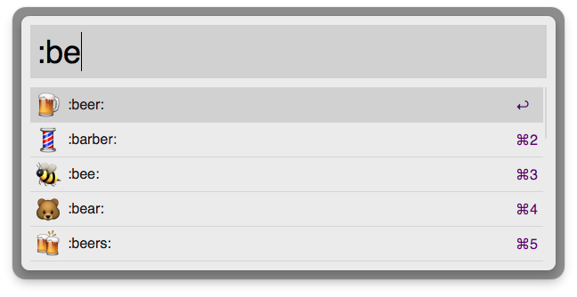

# Search Emoji characters using Alfred 2

It's like
[alfred-emoji-workflow](https://github.com/carlosgaldino/alfred-emoji-workflow),
but it returns characters!

**Usage**: `:[query]`

After you hit `<enter>` the Emoji character (think :beer:, not `:beer:`) will be copied to
your pastebuffer and simultaneous pasted into the active window.

**[Download the workflow](https://github.com/rkneufeld/alfred-emoji-characters-workflow/releases/download/v1.0/emoji-characters.zip)**

## LICENSE

Forthcoming. Presently, All Rights Reserved 2013 - Ryan Neufeld <ryan@rkn.io>. (Obviously you're allowed to *use* the workflow.)

Thanks to [@carlosgaldino](https://github.com/carlosgaldino) for [alfred-emoji-workflow](https://github.com/carlosgaldino/alfred-emoji-workflow).

Thanks to [@zhaocai](https://github.com/zhaocai) for [alfred2-ruby-template](https://github.com/zhaocai/alfred2-ruby-template).

